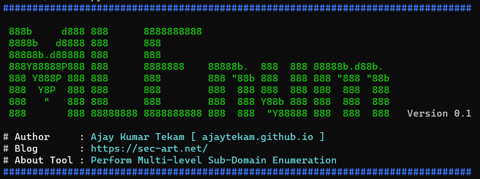

## MLEnum  

Multi-level sub-domain bruteforce/enumeration. The script basically generate multilevel subdomain with provided wordlist and resolve them for alive subdomain.

   

### How it works :  

* Takes input as list of subdomains and wordlist, then generate multi-level subdomains using [dnsgen](https://github.com/ProjectAnte/dnsgen).  
* Varify the generated subdomains using [masdns](https://github.com/blechschmidt/massdns).    
* Also sends notification to telegram (if keys are setted).  

__Tools Used :__ [dnsgen](https://github.com/ProjectAnte/dnsgen), [massdns](https://github.com/blechschmidt/massdns).   

### Help Menu 

```    
usage: MLEnum.py [-h] -s SUBDOMAINLIST [-w WORDLIST] [-l LEVEL]

optional arguments:
  -h, --help            show this help message and exit
  -s SUBDOMAINLIST, --subdomainlist SUBDOMAINLIST
                        SubDomain List to perform multi-level Subdomain Bruteforce
  -w WORDLIST, --wordlist WORDLIST
                        Wordlist to perform subdomain mutation
  -l LEVEL, --level LEVEL
                        Number of levels to perform subdomain mutation (default: 4)
```  

### Usage :  

Run without wordlist (usage default dnsgen wordlist) and with default level 4    

```  
python3 MLEnum.py -s subdomains.txt 
```  

Run with user provided wordlist  

```   
python3 MLEnum.py -s subdomains.txt -w words.txt 
```  

Run with custom level (set 1 to 4)   

```  
python3 MLEnum.py -s subdomains.txt -w words.txt -l 3
```  

### Setting-up Telegram Bot Configuration file 

* Put your Telegram bot API Token and Chat Id into config.ini file and set path on `CONFIGPATH` variable `CONFIGPATH="/home/user/config.ini"` on line 18.    
* Set `config.ini` file like this :   

```   
[telegram]
apiToken = 1234567890:ABCDEFghijklMNOPqRSTUVZXyzABCdefG-H
chatId = 123456789
```   
